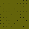

#Conways Game of Life in PHP 
___


#Genral infos about the Game of Life <br><br>

If you're unfamiliar with the Conways Game of Life then checkout the Wikipedia Link below <br>
where you'll find all needed information for it:

> English version: https://en.wikipedia.org/wiki/Conway%27s_Game_of_Life <br>
> German version: https://de.wikipedia.org/wiki/Conways_Spiel_des_Lebens
___

##Rules

Conways Game of Life is two-dimensional grid of squares and cells, where each cell <br>
has two possible states, alive or dead. Each cell interacts with its eight neighbours, <br>
which are the cells that are horizontally, vertically or diagonally adjacent.

1. Any live cell with fewer than two live neighbours dies, as if caused by under-population. <br>
2. Any live cell with two or three live neighbours lives on to the next generation. <br>
3. Any live cell with more than three live neighbours dies, as if by overcrowding. <br>
4. Any dead cell with exactly three live neighbours becomes a live cell, as if by reproduction.
___


##Output of the grid and generations

***Living cells are marked with " * " and dead cells with " - "***

```PHP
Generation: 0
 -  -  -  -  -  -  -  -  -  -
 -  -  -  -  -  -  -  -  -  -
 -  *  *  -  -  -  -  -  -  -
 *  *  -  *  -  -  -  -  -  -
 -  -  *  -  *  -  -  -  -  -
 -  -  -  -  -  -  -  -  -  -
 -  -  -  *  *  -  -  -  -  -
 -  -  -  *  -  -  -  -  -  -
 -  -  -  -  -  -  -  -  -  -
 -  -  -  -  -  -  -  -  -  -


Generation: 1
 -  -  -  -  -  -  -  -  -  -
 -  -  -  -  -  -  -  -  -  -
 *  *  *  -  -  -  -  -  -  -
 *  -  -  *  -  -  -  -  -  -
 -  *  *  *  -  -  -  -  -  -
 -  -  -  -  *  -  -  -  -  -
 -  -  -  *  *  -  -  -  -  -
 -  -  -  *  *  -  -  -  -  -
 -  -  -  -  -  -  -  -  -  -
 -  -  -  -  -  -  -  -  -  -


Generation: 2
 -  -  -  -  -  -  -  -  -  -
 -  *  -  -  -  -  -  -  -  -
 *  *  *  -  -  -  -  -  -  -
 *  -  -  *  -  -  -  -  -  -
 -  *  *  *  *  -  -  -  -  -
 -  -  -  -  *  -  -  -  -  -
 -  -  -  -  -  *  -  -  -  -
 -  -  -  *  *  -  -  -  -  -
 -  -  -  -  -  -  -  -  -  -
 -  -  -  -  -  -  -  -  -  -

```
___

## Creation of a gif

The following class helps you to create an animated GIf, from multiple already created images of <br>
all generated boards:

>TestProjects/output/GIFOutput.php
>
> CLI-command: --output GifOutput

## Creation of a png image 

The following class helps you to create multiple images of all generated boards:

>TestProject/output/PNGOutput.php
> 
> CLI-command: --output PNGOutput
___
## Animated-gif of the board

Use following command to create an animated-gif of the board:
>--output GifOutput

